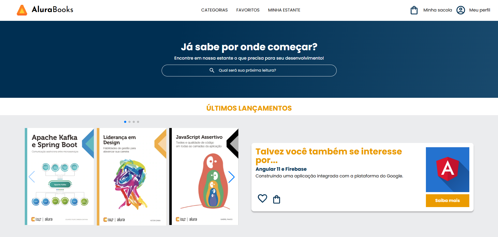

# 📚 AluraBooks  

Este projeto consiste em uma página responsiva da Alura Books, desenvolvida com inspiração no site <strong>Casa do Código</strong>. A proposta foi reproduzir a estrutura e a experiência visual de uma plataforma de livros, apresentando lançamentos, produtos mais vendidos, informações sobre autores e tópicos relacionados à tecnologia. A interface foi construída para se adaptar a diferentes tamanhos de tela, proporcionando uma boa experiência em smartphones, tablets e computadores.

   

### ⚙ Tecnologias Utilizadas

  
  

### ✔️ Funcionalidades 

- 📱 **Design responsivo**: Interface adaptada para smartphones, tablets e computadores, garantindo uma boa experiência em diferentes tamanhos de tela.
- 🎓 **Menu de categorias**: Permite acessar diferentes categorias de livros, como Programação, Front-end, Infraestrutura, Business e Design & UX.
- 🔄 **Carrosséis de livros**: Exibição de lançamentos e livros mais vendidos utilizando o SwiperJS para navegação entre os conteúdos.
- 💡 **Cards de recomendação**: Apresentação de livros e autores recomendados, com informações, imagens e opções para favoritar ou adicionar ao carrinho.
- 🔎 **Tópicos visitados recentemente**: Exibição de assuntos relacionados à tecnologia, como Android, Marketing Digital, Agile, Startups, HTML & CSS, Python, OO e Java.
- 🔗 **Redirecionamento para o site oficial**: Alguns elementos interativos da página possuem links que direcionam o usuário para o site oficial da Casa do Código ao serem clicados.
- 💻 **Layout responsivo**: Os elementos da página são reorganizados e redimensionados de acordo com o dispositivo utilizado.

### 🌐 Como Acessar ?

1. Clone este repositório para sua máquina local.
2. Abra o arquivo `index.html` em seu navegador web.
3. Ou, [Clique aqui](https://alura-books-roan-nu.vercel.app).
4. Explore o AluraBooks e conheça o projeto!